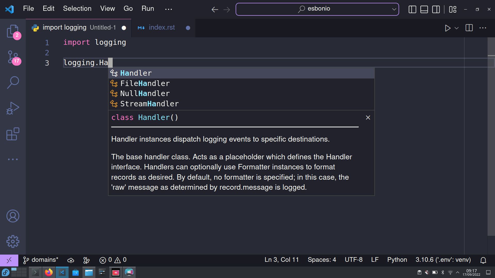
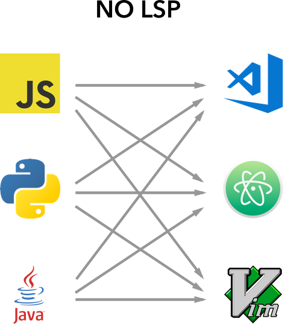
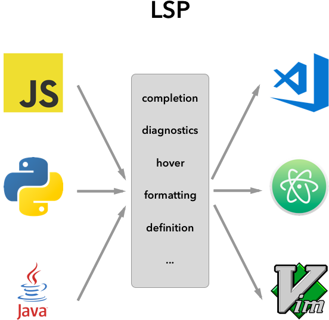

:title: Introducing Esbonio
:css: talk.css
:data-transition-duration: 0

----

Introducing Esbonio
===================

A language server for Sphinx projects

----

Esbonio
-------

v. to explain
^^^^^^^^^^^^^

----

Language Server?
----------------

----

Language Server?
----------------

----

Language Server?
----------------

Source: `VSCode Docs: Language Server Extension Guide <https://code.visualstudio.com/api/language-extensions/language-server-extension-guide>`__

----

Language Server?
----------------

Source: `VSCode Docs: Language Server Extension Guide <https://code.visualstudio.com/api/language-extensions/language-server-extension-guide>`__

----

Esbonio
-------

.. image:: https://swyddfa.github.io/esbonio/docs/stable/en/_images/completion-demo.gif
   :align: center

----

Esbonio
-------

- Github: `swyddfa/esbonio <https://github.com/swyddfa/esbonio>`__
- Documentation: https://swyddfa.github.io/esbonio/
